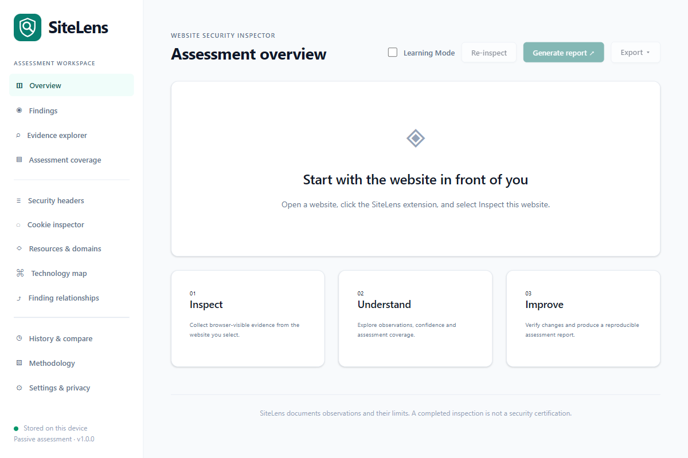
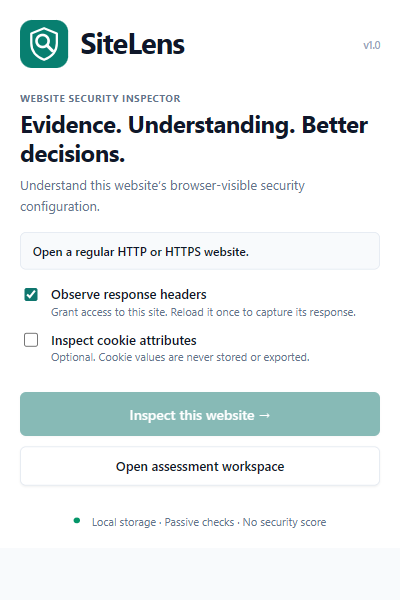

# SiteLens 🔍

> Evidence-first, passive website security inspector & local assessment workspace for Chromium.

SiteLens is a Chromium Manifest V3 extension and local assessment workspace. It records browser-visible observations, confidence, evidence provenance, coverage, and limitations. **It never produces a security score or certifies an application as secure.**

---

## 📸 Screenshots

<details open>
  <summary><strong>Dashboard View</strong></summary>
  <br>
  
</details>

<details open>
  <summary><strong>Extension Popup</strong></summary>
  <br>
  
</details>

---

## 🚀 Installation (Built Extension)

The ready-to-load extension is **apps/extension/dist**. Open `chrome://extensions` or `edge://extensions`, enable Developer mode, choose **Load unpacked**, and select that directory. Do not select the repository root.

Open a website, click SiteLens, and choose **Inspect this website**. Header observation requires optional access to that site. Grant it, reload the website once, then inspect again. A response that was not captured is marked unavailable rather than interpreted as missing headers. Cookie inspection has a separate optional permission and checkbox. Values are omitted.

## ✨ Features

- 58 stable, documented checks with status, severity, confidence, recommendations and explicit limitations.
- Evidence Explorer, provenance, assessment coverage, security headers/CSP, cookie attributes, resources, forms, frames and technology indicators.
- Wappalyzer-style Technology Profile with a local, versioned catalog covering 75 technologies: frameworks, libraries, CMS, commerce, analytics, tag managers, marketing, monitoring, customer support, payments, security widgets, fonts, delivery, servers and backend clues. Search/category/confidence filters and a technology map expose every retained signal and separate observed fingerprints from indirect inference. Both extension and CLI use the same detector; JSON evidence, comparisons and reports include the results.
- Locally bundled identifying logos for all 75 technologies, used in the profile, technology map, overview and self-contained HTML/PDF reports. Unknown historical technology names retain a text fallback. Asset sources and notices are documented in `assets/technologies/README.md` and `SOURCES.json`; no brand-image requests are sent while inspecting a website.
- Bounded static analysis of inline JavaScript: direct expressions/simple aliases, dangerous API inventory and postMessage validation patterns. These are observations, not exploit confirmation.
- Scoped network-response metadata and API inventory; no request/response bodies or credential values.
- Local history, comparisons, rule-change distinctions, lifecycle decisions and selective Verify Fix. Reload the original tab before verifying a header change. Closed tabs and changed URLs cannot verify the old target.
- Local projects/environments, path exclusions, version-bound expiring exceptions, retention controls and access revocation.
- Manual or extension-update re-evaluation of retained evidence. Re-evaluation creates a separate record and cannot verify a website fix.
- Optional, explicitly authorized source-map inspection with scope, redirect checks, rate limits, request budget, timeout and byte limit.
- Thirteen-section HTML reports, browser print-to-PDF, JSON evidence export, CLI, policy-as-code, SARIF and JUnit output.
- Script locations with URL/id, line, column, nested property path and collection method; parsing failures retain labelled text-pattern locations.
- Evidence freshness distinguishes the original open document, navigation/reload, historical/imported/supplemented evidence and unavailable document identity. It does not imply continuously updated runtime evidence.
- Detailed before/after views for headers, cookie attributes, dependency versions, resources and external domains; expandable relationships connect domains to resources, frames and observed API endpoints.
- Developer Tools: fix recipes for Express, Nginx, Apache, Netlify and Vercel; selective scoped external bundle inspection; local backup/restore; report customization; and a CSP report-only rollout assistant.
- Validated, deduplicated backup restore, compatible schema-1 migration, storage usage, assessor/organization/project labels, a local PNG/JPEG report logo, selected observations and executive/developer report audiences.
- Optional supplied advisory datasets using exact semantic-version ranges. Unknown/inferred versions are excluded; runtime applicability remains unknown.

## 🛠️ Build and Development

Use Node 22 or newer and npm:

```text
npm ci
npm run check
npm test
npm run package
```

`check` performs strict type checking, builds the extension/dashboard/CLI, and verifies packaged assets and optional permissions. `package` writes `release/sitelens-1.0.0.zip`. Load the unpacked directory for local development.

```text
npm run test:ui
npm run test:cli
npx playwright install chromium
npm run test:browser
```

The UI test uses generated assessment fixtures; the CLI test navigates only a local fixture. On Windows, UI and CLI fixture tests use installed Chrome, while live extension tests use installed Edge; set `SITELENS_TEST_BROWSER` to another compatible browser executable. Extension integration tests require a Chromium build that supports loading unpacked extensions through launch flags. All ten live extension tests passed in Edge. See `docs/VALIDATION.md` for detailed results and browser test-launch limitations.

## 💻 Command Line Interface (CLI)

```text
node apps/cli/dist/index.js --help
node apps/cli/dist/index.js scan https://example.com --out assessment
node apps/cli/dist/index.js scan https://example.com --policy examples/policy.yml --out assessment
node apps/cli/dist/index.js policy assessment/assessment.json --policy examples/policy.yml
node apps/cli/dist/index.js validate assessment/assessment.json
node apps/cli/dist/index.js export assessment/assessment.json --format sarif --out assessment.sarif
```

Use `--browser "C:\Program Files\Google\Chrome\Application\chrome.exe"` if the downloaded Playwright browser is unavailable. `--scope` accepts a scope JSON file; `--baseline` a matching assessment; `--advisories` a locally supplied dated advisory array. Scan opens a fresh unauthenticated browser session and sends normal page/resource requests within allowed scope (maximum 100). It does not perform attack testing. Third-party resources are blocked unless explicitly allowed in scope. Exit codes: 0 completed/policy passed, 1 error, 2 policy failed. JSON, HTML, SARIF and JUnit files are generated together.

## 🔒 Architecture & Privacy

`apps/extension` contains collection, background coordination, persistence, popup and reports. `apps/dashboard` is the React workspace. `apps/cli` is the browser-backed CLI. Shared packages separate models, rules, evidence, findings, assessment and reporting. Collection and evaluation remain separate.

Assessments use schema version 2 plus engine, rule-set and per-check versions, requested/effective URLs, profile, scope, granted permissions and collection timestamps. Full raw inline code is processed transiently and omitted from stored evidence. Cookie values, storage contents, query strings, fragments and credentials in URLs are removed. Potential secret values are represented by metadata/fingerprints, not complete values. Reports contain security configuration and technology details: review their evidence before sharing. There is no telemetry, team upload or external issue publishing.

The Secrets & Configuration view shows full token/API-key values read from the original live document when they match the stored finding fingerprint. Complete values remain transient: history, reports and exports stay redacted. Reinspect after a reload or navigation; old records cannot recover values that were never saved.

## ⚠️ Deliberate Limits

Technology detection uses SiteLens's own bounded fingerprint catalog, not Wappalyzer's API or commercial database. No technology lookup leaves the device. Only chosen DOM markers, a bounded generator tag, loaded-resource URLs, permitted captured headers and cookie names are inspected; arbitrary runtime globals/getters are not read. Generator/header versions are explicit declarations, asset-path versions are tentative, and conflicting versions remain ambiguous. Shared cookie names have low detection confidence. Backend/database architecture remains unknown without a supporting browser-visible clue. Fingerprints can be imitated or absent; “not detected” does not establish absence.

Open **Developer Tools** in the workspace for the new workflows. Bundle inspection requires an authorized supplemental scope, selected recorded script URLs and optional access to each destination. Up to ten scripts share a batch request budget; redirects consume it too. Every hop is scope- and permission-checked, credentials are omitted, and responses have timeout/byte limits. One batch is allowed per source assessment. Query-redacted script URLs cannot be reconstructed. A separate record contains merged metadata and original collection limitations; raw bundle code and full values are omitted.

Backups contain redacted assessments and lifecycle events; site permissions and live values are excluded. Restore accepts at most 200 records and 10 MB, validates shapes and evidence references, rejects raw source/value fields, skips duplicates, and migrates only compatible schema-1 records. Existing settings remain in place; retention increases if necessary to preserve restored records. Imported evidence stays historical. Review imported free-form evidence before sharing it.

Report preferences are saved locally and apply to subsequent reports. Complete reports retain thirteen sections; executive reports include summary, scope, coverage and recommendations; developer reports omit the executive summary. Finding selection does not narrow the recorded original assessment coverage. The CSP assistant suggests a report-only starting policy from observed origins, explains directives and provides staged deployment guidance. It does not deploy the policy, generate working nonces/hashes or host a violation-report endpoint. Exercise unvisited workflows and review fonts, workers, media and dynamic resources before enforcement.

No crawl, authenticated-session recording, organization-defined executable rule packs, external issue-tracker integration, team sync, live advisory feed, complete interprocedural JavaScript analysis, complete external bundle inventory, or CSP nonce-reuse verification is implemented. Source-map references are limited to collected inline-script references. Header presence, dependency range matches and suspicious API patterns do not establish exploitability. Authentication, authorization, database security, business logic and TLS certificate/protocol audits remain outside browser assessment coverage. Active attack testing is explicitly unsupported.

The root-level JavaScript prototype is legacy; current builds come from `apps/` and `packages/`.
